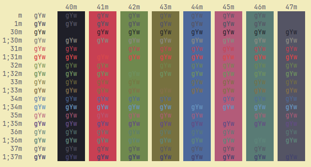
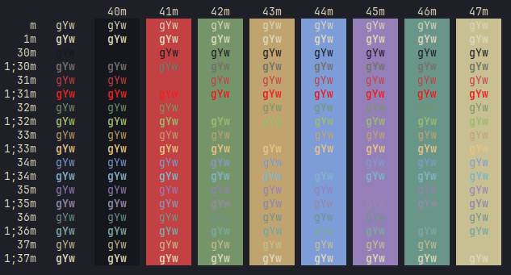
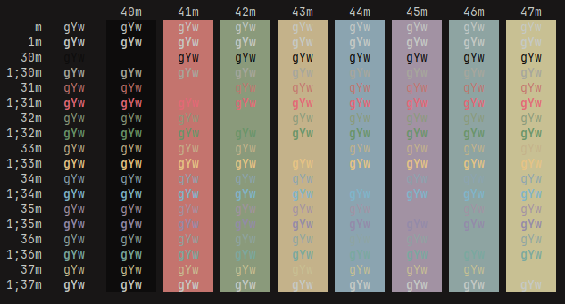

# Kanagawa for Konsole
Konsole colorschemes for all three variants of [Kanagawa](https://github.com/rebelot/kanagawa.nvim).

# Install
Place the .colorscheme files in `.local/share/konsole`

# Screenshots
**Kanagawa Lotus**

**Kanagawa Wave**

**Kanagawa Dragon**

